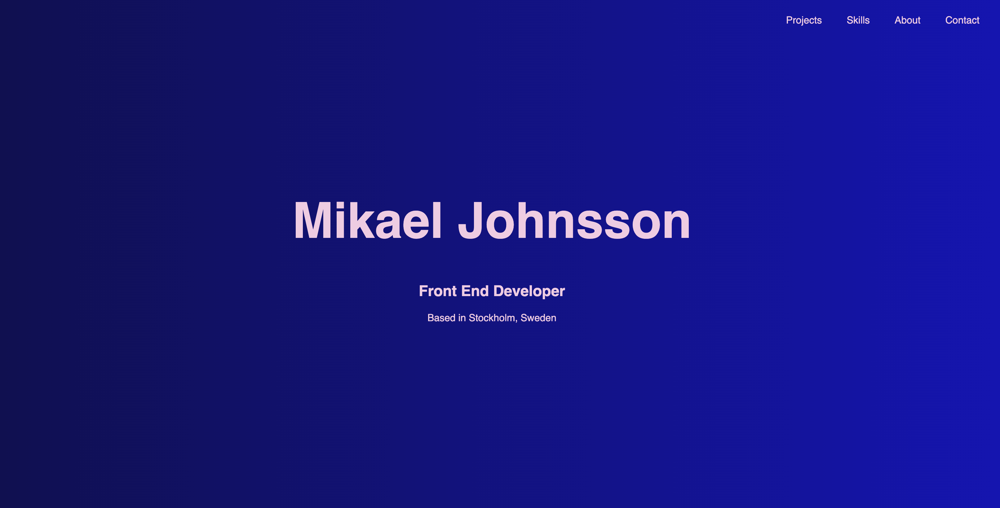

# Portfolio page for Mikael Johnsson

I am Mikael Johnsson, a Front End Developer from Sweden, and this is my portfolio. On this page you will find a selection of my projects, my skillset and my CV for download.

I am currently studying at Medieinstitutet in Stockholm, graduating in the spring of 2027. Avaliable for internship Sept 21 - Nov 27 of 2026 and in early spring 2027.

Please get in touch at mikaeljohanjohnsson [at] gmail.com
